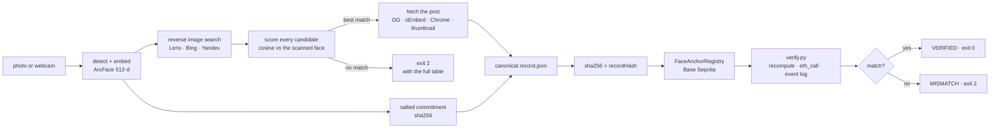

# FaceAnchor

A face scan becomes a web search, the match becomes an evidence bundle, and the
bundle's hash becomes an immutable on-chain record that anyone can re-verify.

[](https://github.com/samarthputhraya/faceanchor/actions/workflows/ci.yml)


*Hacker House Goa 2026, shortlisting task 3.*
Demo video: _added before submission_

## What it does

Three stages, matching the three requirements of the task.

1. **Face identification.** A photograph or a live webcam frame is detected and
   encoded with ArcFace (`insightface` buffalo_l: SCRFD-10GF detector, 512-d
   `w600k_r50` embedding). The embedding never leaves the machine; what is
   published is a salted commitment to it.
2. **A genuine web search.** The face crop is sent to Google Lens through
   SerpApi, optionally alongside Bing and Yandex reverse image search. Every
   returned social-media URL is fetched, every face in its image is embedded,
   and each candidate is scored by cosine similarity against the scanned face.
   The rejected candidates stay in the output. Nothing is hardcoded: with no
   candidate above the threshold the run exits with code 2 and prints the table
   of everything it checked.
3. **Blockchain verification.** The evidence bundle is serialised to canonical
   JSON, hashed with SHA-256, and written to a registry contract on Base
   Sepolia. `verify.py` recomputes every hash from the files on disk, reads the
   record back through `eth_call` **and** the emitted event log, and reports
   field by field. Change one character of the bundle and it fails.



## How to run

Python 3.12. No C or C++ compiler is needed: every dependency ships as a wheel.

```bash
git clone https://github.com/samarthputhraya/faceanchor
cd faceanchor
python -m venv .venv && .venv\Scripts\activate     # Windows
# source .venv/bin/activate                        # macOS / Linux
pip install -r requirements.txt
cp .env.example .env                               # then fill in the keys below
```

Run the whole pipeline against the in-process chain, which needs no key, no
faucet and no network beyond the search itself:

```bash
python -m faceanchor run --image demo/sundar_pichai.jpg --chain local
```

Against a public testnet:

```bash
python -m faceanchor newkey                        # burner wallet, testnet only
python -m faceanchor deploy --chain base-sepolia   # once
python -m faceanchor run --image demo/sundar_pichai.jpg --chain base-sepolia
```

Stage by stage, if you would rather watch each one:

```bash
python -m faceanchor scan    --image demo/sundar_pichai.jpg
python -m faceanchor search  --engines lens,bing,yandex
python -m faceanchor extract
python -m faceanchor anchor  --chain base-sepolia
python -m faceanchor verify  --biometric
python -m faceanchor tamper-demo --field caption
```

The dashboard shows the same run in a browser, including a live webcam scan:

```bash
cd ui && npm install && npm run build && cd ..
python -m faceanchor serve                          # http://127.0.0.1:8000
```

`python -m faceanchor status` reports which keys and deployments are in place
without printing any of them.

### Configuration

| Variable | Needed for | Where to get it |
| --- | --- | --- |
| `SERPAPI_KEY` | Google Lens, Bing, Yandex search | [serpapi.com](https://serpapi.com) — 250 searches/month free |
| `SEARCHAPI_KEY` | Lens fallback | [searchapi.io](https://www.searchapi.io) — 100 free |
| `SERPER_KEY` | name-based second hop | [serper.dev](https://serper.dev) — 2,500 free |
| `PRIVATE_KEY` | anchoring on a public testnet | `python -m faceanchor newkey`, funded from a faucet |
| `RPC_URL` | overrides the default RPC | any Base Sepolia endpoint |
| `PINATA_JWT` | optional IPFS pin of the bundle | [pinata.cloud](https://app.pinata.cloud) |

No key is required for `--chain local`, the tests, or CI.

## Which blockchain

| | |
| --- | --- |
| Network | Base Sepolia (OP-stack Ethereum L2 testnet) |
| Chain id | 84532 |
| Contract | `FaceAnchorRegistry`, Solidity 0.8.26, optimizer on, 200 runs |
| Address | _filled in by `deploy`; see `deployments/base-sepolia.json`_ |
| Explorer | [sepolia.basescan.org](https://sepolia.basescan.org) |
| Cost | about 299,000 gas per record, roughly 0.000003 ETH at Base Sepolia gas |
| Fallbacks | Ethereum Sepolia (11155111), or `--chain local`, an in-process py-evm chain running the identical contract |

**On-chain:** the record hash, the input image SHA-256, the salted face
commitment, the post URL hash, the post image SHA-256, a 64-bit perceptual
hash, the similarity in basis points, the submitter and a timestamp.

**Never on-chain:** the photograph, the face embedding, the commitment salt, or
any name. Face embeddings can be inverted back into a recognisable face, so
publishing one would publish a biometric. The salt stays in
`face_secret.json`, which is gitignored, and that is what makes the commitment
binding rather than guessable.

The contract also exposes `hamming(a, b)` so a verifier can show that a
re-encoded copy of an image is still the same picture without the image ever
being stored.

## Verify our run yourself

The verifier needs one dependency and no API keys.

```bash
pip install web3==7.16.0
python verify.py --record evidence/demo/<run_id>/record.json
```

It prints the recomputed hashes beside the on-chain values and exits 0 on
`VERIFIED`, 2 on `MISMATCH`. The record hash is a plain SHA-256 of the file, so
you can confirm it independently:

```bash
sha256sum evidence/demo/<run_id>/record.json
```

Then break it, and watch it fail:

```bash
python verify.py --record evidence/demo/<run_id>/record.json --tamper caption
```

## The evidence bundle

Each run writes a self-contained folder. Only the record itself is hashed and
anchored; everything else is there so the run can be audited by hand.

```
evidence/runs/<run_id>/
  input.jpg              the scanned image
  face_crop.jpg          what was sent to the search engine
  face.json              engine, model file hashes, bbox, confidence, commitment
  face_secret.json       salt + quantised embedding   (gitignored, never published)
  search/*.raw.json      each provider's response, verbatim, with its search id
  search/quota.json      searches remaining before and after the run
  candidates.json        every candidate with its cosine score and verdict
  thumbs/                the images that were actually compared
  post.json              author, caption, date, image, and how each was obtained
  post_image.jpg         the image fetched from the matched post
  record.json            canonical JSON; this exact file is what gets hashed
  record.sha256          the anchored hash
  anchor.json            transaction, block, gas, explorer link, decoded event
  verify_log.json        the field-by-field verification result
```

## How the search is genuinely a search

The task asks for a real search rather than a pre-picked result, so the design
makes that checkable rather than asking to be believed.

- Every provider response is written to disk untouched, with the provider's own
  `search_id` and timestamp. Those ids appear in the SerpApi dashboard.
- The remaining search quota is printed before and after the run.
- Every candidate is listed with its cosine score, including the ones that
  lost. A cherry-picked result cannot produce rejections.
- The threshold, the metric, the model and the hashes of the model files all go
  into the hashed record, so the decision rule is fixed before the answer.
- There are no post URLs anywhere in the source. `grep -r "instagram.com/p/" faceanchor/`
  returns nothing.
- When nothing clears the threshold the run exits 2 and says so. There is no
  fallback that invents a match.
- Running a different photograph produces a different candidate set; running a
  private individual's photograph is expected to produce no match at all.

## Face matching

| | |
| --- | --- |
| Detector | SCRFD-10GF (`det_10g.onnx`) |
| Encoder | ArcFace `w600k_r50`, 512-d, L2-normalised |
| Metric | cosine similarity |
| Decision | match at 0.40, strong at 0.50, weak band 0.30 to 0.40 |
| Fallback engine | OpenCV YuNet + SFace, 128-d, threshold 0.363 (`--engine sface`) |

Measured on this machine with Wikimedia portraits, first load 28 s then about
1 s per image on CPU:

| pair | cosine | expected |
| --- | --- | --- |
| Pichai, two different photographs | 0.759 | same person |
| Pichai, two crops of one photograph | 0.993 | same person |
| Kohli, two different photographs | 0.625 | same person |
| Pichai vs Nadella | −0.038 | different |
| Pichai vs Musk | −0.059 | different |
| Musk vs Altman | 0.069 | different |
| Pichai vs Kohli | 0.071 | different |

Search-engine thumbnails are small, so a true match from a thumbnail often
lands between 0.40 and 0.55 rather than higher. When the full-size image can be
fetched from the post, the score is recomputed on it and the record states
which image the final number came from.

## Tests and CI

```bash
pytest -q
```

43 tests, no network, no API keys and no model download, so they also run in CI
on Ubuntu and Windows. They cover canonical byte stability across key order,
float drift and unicode; the record hash equalling `sha256sum record.json`; the
commitment being reproducible, salted and binding; URL canonicalisation and
candidate ranking; and the registry's anchor, verify, tamper and immutability
behaviour against a real in-process EVM.

One of them found a real defect during development: X share parameters such as
`?s=20` were defeating URL deduplication, so the same post returned by two
engines counted as two candidates.

## Known limitations

- **Recall depends on the search index.** Google Lens indexes public content
  well for public figures and poorly for private individuals. A private account
  will not be found, and that is the correct outcome, not a bug.
- **Thumbnail resolution caps confidence.** Where a platform blocks direct
  image fetches the comparison uses the search engine's thumbnail, typically
  200 to 300 px. The record records `image_source` so this is never hidden.
- **Platforms actively block scripts.** Instagram shows a login wall after one
  or two anonymous views, Reddit removed unauthenticated `.json` in May 2026,
  and X serves a JavaScript shell. The extractor degrades through Chrome and
  then the search thumbnail, and writes down which tier it used.
- **Some networks block social domains outright.** This was developed on a LAN
  whose filter blocks Instagram, X, Facebook and TikTok for non-browser
  clients. The pipeline still completes there, using thumbnails.
- **Dates are sometimes derived, not read.** When a page hides the timestamp it
  is decoded from the post id. `posted_at_source` distinguishes `exact`,
  `derived_from_id` and `approx`.
- **No liveness detection.** A photograph of a photograph will scan. This
  identifies faces; it does not prove someone is present.
- **A match is evidence, not proof of identity.** Cosine similarity above a
  threshold is a strong signal, not a legal identification.
- **Testnet, not mainnet.** Base Sepolia state is not guaranteed forever.
- **Model licence.** The insightface model pack is licensed for non-commercial
  research use. The OpenCV fallback (YuNet MIT, SFace Apache-2.0) is not
  restricted.
- **Free-tier quota.** SerpApi allows 250 searches a month; each run uses two to
  five. Responses are cached on disk by query-image hash so repeats are free.

## Ethics and privacy

Face search is dual-use, so the design constrains it deliberately.

- Nothing biometric is published. Only a salted hash of a quantised embedding
  reaches the chain, and the salt never leaves the operator's machine.
- Only public posts are read. The tool never logs in, never bypasses a login
  wall, and makes very few requests per run.
- The demo subjects are public figures with published portraits, credited in
  `demo/sources.json`. Use it on yourself or on people who have agreed.
- Under India's DPDP Act facial geometry is personal data, and the
  publicly-available-data exemption covers only what a person published
  themselves. Anchoring hashes rather than content keeps identifiable material
  off an immutable ledger.
- Anything anchored is permanent. That is the point of the record and also its
  risk, which is why the anchored fields are hashes.

## Repository layout

```
faceanchor/          pipeline package
  face/              detection, embedding, salted commitment
  search/            providers, URL canonicalisation, candidate scoring
  extract/           post extraction with three transports
  chain/             contract compilation and the chain client
  cli.py  api.py     terminal and web front ends
contracts/           FaceAnchorRegistry.sol and its committed build artifact
deployments/         deployed address, deploy transaction and block per chain
ui/                  React dashboard
tests/               43 tests, no keys required
verify.py            standalone verifier: web3 and the standard library only
demo/                public-figure portraits with their sources
evidence/demo/       one sanitised real run, without the biometric secret
```

## Credits

[insightface](https://github.com/deepinsight/insightface) for buffalo_l,
[OpenCV Zoo](https://github.com/opencv/opencv_zoo) for YuNet and SFace,
[SerpApi](https://serpapi.com) for Google Lens access,
[web3.py](https://github.com/ethereum/web3.py) and
[py-evm](https://github.com/ethereum/py-evm) for the chain layer, and
[React Bits](https://reactbits.dev) (MIT) for the interface component patterns.

MIT licensed. Portraits in `demo/` are from Wikimedia Commons under their own
licences, listed in `demo/sources.json`.
