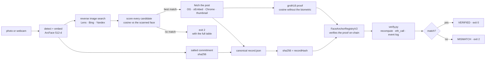

# FaceAnchor

A face scan becomes a web search, the match becomes an evidence bundle, and the
bundle's hash becomes an immutable on-chain record that anyone can re-verify.

**And the chain refuses to record a face match it has not been shown proof of.**
A registry that stores a similarity score is only as honest as whoever wrote it
&mdash; nothing stops an operator anchoring `0.99` against a stranger. FaceAnchor
generates a zero-knowledge proof that the similarity really is the cosine of the
two committed embeddings, and the contract verifies that proof on-chain before it
will store anything. The biometric never leaves the machine.

```
$ python -m faceanchor forge-demo
honest       0.9916   ACCEPTED
forged       0.9999   REJECTED   SimilarityNotProven
off-by-one   0.9917   REJECTED   SimilarityNotProven
```

And you do not have to take the match itself on trust either &mdash; the face
found in the post is re-derivable from published data:

```
$ python -m faceanchor replicate
model identity           PASS
published image sha256   PASS
re-derived commitment    PASS      <- image -> model -> salt -> the committed vector
re-derived embedding     PASS      cosine 1.0000
live post image          PASS      hamming 0 against the live post
```

[](https://github.com/samarthputhraya/faceanchor/actions/workflows/ci.yml)


*Hacker House Goa 2026, shortlisting task 3.*
Demo video: _added before submission_

## What it does

Three stages, matching the three requirements of the task.

1. **Face identification.** A photograph or a live webcam frame is detected and
   encoded with ArcFace (`insightface` buffalo_l: SCRFD-10GF detector, 512-d
   `w600k_r50` embedding). The embedding never leaves the machine; what is
   published is a salted commitment to it.
2. **A genuine web search.** The face crop is sent to Google Lens through
   SerpApi, optionally alongside Bing and Yandex reverse image search. Every
   returned social-media URL is fetched, every face in its image is embedded,
   and each candidate is scored by cosine similarity against the scanned face.
   The rejected candidates stay in the output. Nothing is hardcoded: with no
   candidate above the threshold the run exits with code 2 and prints the table
   of everything it checked.
3. **Blockchain verification.** The evidence bundle is serialised to canonical
   JSON, hashed with SHA-256, and written to a registry contract on Base
   Sepolia. `verify.py` recomputes every hash from the files on disk, reads the
   record back through `eth_call` **and** the emitted event log, and reports
   field by field. Change one character of the bundle and it fails.

Plus one the task did not ask for:

4. **A proof that the match is honest.** A Groth16 proof (17,797 constraints,
   ~10 s on CPU) shows that the published dot product and norms belong to the
   two committed embeddings, without revealing either. `FaceAnchorRegistryV2`
   verifies it on-chain and rejects any similarity the proof does not support
   &mdash; including one basis point too many.
5. **And the face in the post can be re-derived by anyone.** The post image is
   public, so its salt is published too: `python -m faceanchor replicate` runs
   the same model over the published image and reproduces the committed vector
   from the bundle alone, with no secret and no proving key.

Exactly which bindings that leaves proven, and which it does not, is set out in
[docs/what-is-proven.md](docs/what-is-proven.md); the circuit itself, the
constraint budget and the trusted-setup caveat are in
[docs/zero-knowledge-proof.md](docs/zero-knowledge-proof.md).



## How to run

Python 3.12. No C or C++ compiler is needed: every dependency ships as a wheel.

```bash
git clone https://github.com/samarthputhraya/faceanchor
cd faceanchor
python -m venv .venv && .venv\Scripts\activate     # Windows
# source .venv/bin/activate                        # macOS / Linux
pip install -r requirements.txt
cp .env.example .env                               # then fill in the keys below
```

To generate proofs you also need Node 20+ and a one-off build of the circuit.
It downloads a prebuilt `circom` binary, runs its own trusted setup and exports
the Solidity verifier — about three minutes, no compiler, no Rust:

```bash
powershell -ExecutionPolicy Bypass -File zk/build.ps1
```

Skip it and everything else still works: runs without a proof anchor to the v1
registry. **Checking** a published proof needs neither the build nor the
proving key, only `zk/verification_key.json`.

Run the whole pipeline against the in-process chain, which needs no key, no
faucet and no network beyond the search itself:

```bash
python -m faceanchor run --image demo/sundar_pichai.jpg --chain local
```

Against a public testnet:

```bash
python -m faceanchor newkey                        # burner wallet, testnet only
python -m faceanchor deploy --chain base-sepolia   # once
python -m faceanchor run --image demo/sundar_pichai.jpg --chain base-sepolia
```

Stage by stage, if you would rather watch each one:

```bash
python -m faceanchor scan    --image demo/sundar_pichai.jpg
python -m faceanchor search  --engines lens,bing,yandex
python -m faceanchor extract
python -m faceanchor prove                          # ~10 s, no search quota
python -m faceanchor anchor  --chain base-sepolia   # v2 when a proof exists
python -m faceanchor verify  --biometric
python -m faceanchor tamper-demo --field caption
python -m faceanchor forge-demo                     # the chain refuses a lie
python -m faceanchor replicate                      # re-derive the post face
```

`forge-demo` asks the live contract to accept a similarity the proof does not
support. Every attempt goes through `eth_call`, which runs against real chain
state and throws the result away, so it writes nothing and costs no gas.

The dashboard shows the same run in a browser, including a live webcam scan:

```bash
cd ui && npm install && npm run build && cd ..
python -m faceanchor serve                          # http://127.0.0.1:8000
```

`python -m faceanchor status` reports which keys and deployments are in place
without printing any of them.

### Configuration

| Variable | Needed for | Where to get it |
| --- | --- | --- |
| `SERPAPI_KEY` | Google Lens, Bing, Yandex search | [serpapi.com](https://serpapi.com) — 250 searches/month free |
| `SEARCHAPI_KEY` | Lens fallback | [searchapi.io](https://www.searchapi.io) — 100 free |
| `SERPER_KEY` | name-based second hop | [serper.dev](https://serper.dev) — 2,500 free |
| `PRIVATE_KEY` | anchoring on a public testnet | `python -m faceanchor newkey`, funded from a faucet |
| `RPC_URL` | overrides the default RPC | any Base Sepolia endpoint |
| `PINATA_JWT` | optional IPFS pin of the bundle | [pinata.cloud](https://app.pinata.cloud) |

No key is required for `--chain local`, the tests, or CI.

## Which blockchain

| | |
| --- | --- |
| Network | Base Sepolia (OP-stack Ethereum L2 testnet) |
| Chain id | 84532 |
| Contracts | Solidity 0.8.26, optimizer on, 200 runs (v2 and the verifier need `viaIR`) |
| **Registry v2** (proof-gated) | [`0x3827D54282047caDA437D7AeBB33e05D617Ca1b9`](https://sepolia.basescan.org/address/0x3827D54282047caDA437D7AeBB33e05D617Ca1b9) |
| **Groth16 verifier** | [`0xf1175acf6A63c23f967431F1c7feB46eC1957c22`](https://sepolia.basescan.org/address/0xf1175acf6A63c23f967431F1c7feB46eC1957c22) |
| Registry v1 (still live) | [`0xAFeB0eDaC32b4fD7710418211619ddE36C735D43`](https://sepolia.basescan.org/address/0xAFeB0eDaC32b4fD7710418211619ddE36C735D43) |
| Demo record, v2 + proof | [`0xd77c00e8958b500c…`](https://sepolia.basescan.org/tx/0xd77c00e8958b500c7f10ccdaf3a33453679e4fcc5bda61764b2e352c75592bd7) |
| Demo record, v1 | [`0xb20ba2b7ffd38b35…`](https://sepolia.basescan.org/tx/0xb20ba2b7ffd38b35f366e04799788a088b3c4728f23472442e7212418fd05f3f) |
| Explorer | [sepolia.basescan.org](https://sepolia.basescan.org) |
| Cost | 299,000 gas per v1 record; 634,747 for a v2 record, the extra being on-chain proof verification |
| Fallbacks | Ethereum Sepolia (11155111), or `--chain local`, an in-process py-evm chain running the identical contracts |

v1 stays deployed and its record stays verifiable exactly as first published.
v2 is additive: a run only reaches it if it carries a proof.

**On-chain:** the record hash, the input image SHA-256, the salted face
commitment, the post URL hash, the post image SHA-256, a 64-bit perceptual
hash, the similarity in basis points, the submitter and a timestamp. v2 adds
the two Poseidon commitments and the proven dot product and squared norms.

**Never on-chain and never published:** the photograph, either face embedding,
the scan-side salt, or any name. The *post-side* salt **is** published, on
purpose: that face is in a public image, so salting it hides nothing and
publishing it is what lets anyone re-derive the commitment. See
[docs/what-is-proven.md](docs/what-is-proven.md). Face embeddings can be inverted back into a recognisable face, so
publishing one would publish a biometric. The salt stays in
`face_secret.json`, which is gitignored, and that is what makes the commitment
binding rather than guessable.

The contract also exposes `hamming(a, b)` so a verifier can show that a
re-encoded copy of an image is still the same picture without the image ever
being stored.

## Verify our run yourself

The verifier needs one dependency and no API keys.

```bash
pip install web3==7.16.0
python verify.py --record evidence/demo/20260905T140450Z-91d69d/record.json
```

It prints the recomputed hashes beside the on-chain values and exits 0 on
`VERIFIED`, 2 on `MISMATCH`. The record hash is a plain SHA-256 of the file, so
you can confirm it independently:

```bash
sha256sum evidence/demo/20260905T140450Z-91d69d/record.json
```

Then break it, and watch it fail:

```bash
python verify.py --record evidence/demo/20260905T140450Z-91d69d/record.json --tamper caption
```

## A real run

One complete run is committed under `evidence/demo/20260905T140450Z-91d69d/`, minus the biometric
secret. A photograph of Sundar Pichai from Wikimedia Commons went in; Google
Lens returned 59 results, of which 7 were social posts; all 7 were face-verified
and the best was anchored on Base Sepolia.

| | |
| --- | --- |
| Google Lens search id | `6a9c218f2088af67293fc518` (visible in the SerpApi dashboard) |
| Results returned | 59, of which 7 were social posts |
| Best match | a Reddit post, cosine 0.9553 on the search thumbnail |
| Rescored on the full image | 0.9667 |
| Record hash | `2f72332c7f45fd35d73ada584dee1bc96e58d66a6cdd9e6d00558b75e72bdb4b` |
| Transaction | [`0xb20ba2b7ffd38b35…`](https://sepolia.basescan.org/tx/0xb20ba2b7ffd38b35f366e04799788a088b3c4728f23472442e7212418fd05f3f) |
| Biometric re-scan | 0.9950 against the stored vector |

`exact_matches` returned nothing for this query. That is recorded in
`search/quota.json` rather than hidden, because a partial engine response is
part of what actually happened.

### And one with a proof

`evidence/demo/20260905T183504Z-f964ca/` is a second complete run, anchored to
the proof-gated registry.

| | |
| --- | --- |
| Best match | an x.com post, cosine 0.9939 on the full post image |
| Proven cosine | 0.9916 &mdash; `dot` 16053, `normA` 16155, `normB` 16220 |
| Proving time | ~10 s on CPU, 0 search quota |
| Record hash | `f275472bf35b2f64d4f7aa9cb060f467875d3a4093e69365f665fca110428003` |
| Transaction | [`0xd77c00e8958b500c…`](https://sepolia.basescan.org/tx/0xd77c00e8958b500c7f10ccdaf3a33453679e4fcc5bda61764b2e352c75592bd7) |
| Gas | 634,747, including on-chain proof verification |
| Forge attempt | 0.9999 and 0.9917 both rejected `SimilarityNotProven` |
| Replication | 5 of 5 checks pass from published data; live post pHash distance 0 |

The proof in that bundle can be checked without the repo's proving key or any
of the biometric material:

```bash
cd zk && npm install && cd ..    # once: zk/node_modules is not committed
node zk/node_modules/snarkjs/build/cli.cjs groth16 verify   zk/verification_key.json   evidence/demo/20260905T183504Z-f964ca/zk_public.json   evidence/demo/20260905T183504Z-f964ca/zk_proof.json
```

## The evidence bundle

Each run writes a self-contained folder. Only the record itself is hashed and
anchored; everything else is there so the run can be audited by hand.

```
evidence/runs/<run_id>/
  input.jpg              the scanned image
  face_crop.jpg          what was sent to the search engine
  face.json              engine, model file hashes, bbox, confidence, commitment
  face_secret.json       salt + quantised embedding   (gitignored, never published)
  search/*.raw.json      each provider's response, verbatim, with its search id
  search/quota.json      searches remaining before and after the run
  candidates.json        every candidate with its cosine score and verdict
  thumbs/                the images that were actually compared
  post.json              author, caption, date, image, and how each was obtained
  post_image.jpg         the image fetched from the matched post
  record.json            canonical JSON; this exact file is what gets hashed
  record.sha256          the anchored hash
  anchor.json            transaction, block, gas, explorer link, decoded event
  verify_log.json        the field-by-field verification result
```

## How the search is genuinely a search

The task requires a genuine search, not a pre-picked result. Four things make
that checkable rather than asserted:

- **Every provider response is written to disk verbatim**, with its SerpApi
  search id, before anything is parsed. The ids are visible in the SerpApi
  dashboard.
- **Rejected candidates stay in the output.** `candidates.json` keeps every URL
  scored, including the failures, with its cosine and verdict.
- **No match means exit 2.** There is no fallback to a curated URL. Grep the
  search module for `instagram.com/` and you will not find one.
- **The `control` command re-scores a finished run against a different
  person's face.** On the demo run: 20 of 20 candidates matched the scanned
  face, 0 of 20 matched the control. It costs no search quota, because it
  re-uses thumbnails already on disk.

Full detail, including the control-run table: [docs/genuine-search.md](docs/genuine-search.md).

## Face matching

ArcFace `w600k_r50` via insightface (512-d, L2-normalised), cosine similarity,
MATCH at 0.40 and WEAK at 0.30. The OpenCV YuNet + SFace fallback (128-d) has
its own calibration at 0.363. Measured scores on the demo portraits, and the
reasoning behind the thresholds: [docs/face-matching.md](docs/face-matching.md).

## Tests and CI

```bash
pytest -q
```

66 tests, no network, no API keys and no model download, so they also run in CI
on Ubuntu and Windows. They cover canonical byte stability across key order,
float drift and unicode; the record hash equalling `sha256sum record.json`; the
commitment being reproducible, salted and binding; URL canonicalisation and
candidate ranking; and the registry's anchor, verify, tamper and immutability
behaviour against a real in-process EVM.

One of them found a real defect during development: X share parameters such as
`?s=20` were defeating URL deduplication, so the same post returned by two
engines counted as two candidates.

## Known limitations

- **The scan-side face is not publicly bound to its own image.** The proof
  binds the similarity to two commitments; `replicate` binds the *post-side*
  commitment to the published image, so that half needs no trust. The scanned
  image is private by design, and nothing published proves the scanned vector
  came from it — that would need ArcFace inside the circuit, which is roughly
  15× beyond the largest trusted setup that exists. Two things narrow it:
  `commitmentA` is fixed during `scan` before the search runs, so it cannot be
  retrofitted; and because the post side *is* pinned, a forger must commit to a
  vector genuinely close to a publicly verifiable target. Full binding is
  available on request via `verify --biometric`, which re-runs the model against
  `input.jpg` using the withheld secret.
  See [docs/what-is-proven.md](docs/what-is-proven.md).
- **The trusted setup is a development ceremony.** Every public Powers of Tau
  mirror in the snarkjs README returns `AccessDenied` as of September 2026, so
  `zk/build.ps1` runs its own. Whoever ran it could in principle forge proofs.
  A real deployment needs the Perpetual Powers of Tau and a multi-party phase 2.
- **The proven similarity differs slightly from the reported one.** The circuit
  works on int8-quantised vectors; the pipeline scores in float32. On the demo
  run that is 0.9916 against 0.9939. Both numbers are published rather than
  reconciled.
- **Proving is 512-d only.** The circuit is compiled for insightface. A run that
  falls back to OpenCV SFace (128-d) produces no proof and anchors to v1.
- **Recall depends on the search index.** Google Lens indexes public content
  well for public figures and poorly for private individuals. A private account
  will not be found, and that is the correct outcome, not a bug.
- **Thumbnail resolution caps confidence.** Where a platform blocks direct
  image fetches the comparison uses the search engine's thumbnail, typically
  200 to 300 px. The record records `image_source` so this is never hidden.
- **Platforms actively block scripts.** Instagram shows a login wall after one
  or two anonymous views, Reddit removed unauthenticated `.json` in May 2026,
  and X serves a JavaScript shell. The extractor degrades through Chrome and
  then the search thumbnail, and writes down which tier it used.
- **Some networks block social domains outright.** This was developed on a LAN
  whose filter blocks Instagram, X, Facebook and TikTok for non-browser
  clients. The pipeline still completes there, using thumbnails.
- **Dates are sometimes derived, not read.** When a page hides the timestamp it
  is decoded from the post id. `posted_at_source` distinguishes `exact`,
  `derived_from_id` and `approx`.
- **No liveness detection.** A photograph of a photograph will scan. This
  identifies faces; it does not prove someone is present.
- **A match is evidence, not proof of identity.** Cosine similarity above a
  threshold is a strong signal, not a legal identification.
- **Testnet, not mainnet.** Base Sepolia state is not guaranteed forever.
- **Model licence.** The insightface model pack is licensed for non-commercial
  research use. The OpenCV fallback (YuNet MIT, SFace Apache-2.0) is not
  restricted.
- **Free-tier quota.** SerpApi allows 250 searches a month; each run uses two to
  five. Responses are cached on disk by query-image hash so repeats are free.

## Ethics and privacy

Face search is dual-use, so the design constrains it deliberately.

- Nothing biometric is published. Only a salted hash of a quantised embedding
  reaches the chain, and the salt never leaves the operator's machine.
- Only public posts are read. The tool never logs in, never bypasses a login
  wall, and makes very few requests per run.
- The demo subjects are public figures with published portraits, credited in
  `demo/sources.json`. Use it on yourself or on people who have agreed.
- Under India's DPDP Act facial geometry is personal data, and the
  publicly-available-data exemption covers only what a person published
  themselves. Anchoring hashes rather than content keeps identifiable material
  off an immutable ledger.
- Anything anchored is permanent. That is the point of the record and also its
  risk, which is why the anchored fields are hashes.

## Repository layout

```
faceanchor/          pipeline package
  face/              detection, embedding, salted commitment
  search/            providers, URL canonicalisation, candidate scoring
  extract/           post extraction with three transports
  chain/             contract compilation and the chain client
  cli.py  api.py     terminal and web front ends
  zk/                proof generation, shelling out to snarkjs
contracts/           v1, v2 and the generated verifier, with build artifacts
deployments/         deployed address, deploy transaction and block per chain
zk/                  facematch.circom, the build script, verification_key.json
ui/                  React dashboard
tests/               66 tests, no keys required
verify.py            standalone verifier: web3 and the standard library only
demo/                public-figure portraits with their sources
evidence/demo/       one sanitised real run, without the biometric secret
```

## Credits

[insightface](https://github.com/deepinsight/insightface) for buffalo_l,
[OpenCV Zoo](https://github.com/opencv/opencv_zoo) for YuNet and SFace,
[SerpApi](https://serpapi.com) for Google Lens access,
[web3.py](https://github.com/ethereum/web3.py) and
[py-evm](https://github.com/ethereum/py-evm) for the chain layer, and
[React Bits](https://reactbits.dev) (MIT) for the interface component patterns.

MIT licensed. Portraits in `demo/` are from Wikimedia Commons under their own
licences, listed in `demo/sources.json`.
